```
  .oooooo.                 .                                   
 d8P'  `Y8b              .o8                                   
888      888  .ooooo.  .o888oo  .oooo.   ooo. .oo.    .ooooo.  
888      888 d88' `"Y8   888   `P  )88b  `888P"Y88b  d88' `88b 
888      888 888         888    .oP"888   888   888  888ooo888 
`88b    d88' 888   .o8   888 . d8(  888   888   888  888    .o 
 `Y8bood8P'  `Y8bod8P'   "888" `Y888""8o o888o o888o `Y8bod8P' 
                                                               
                                                               
                                                                                                                                                                                                           ⠀⠀⠀⠀⠀⠀⠀⠀⠀⠀
```

<div align="center">

**High-Performance Reinforcement Learning**

*Blazingly fast RL library written in Rust*

[](https://www.rust-lang.org/)
[](LICENSE)
[](https://developer.apple.com/metal/)
[](#simd-optimizations)

</div>

---

## Features

- **1000x faster than Python SB3** - Pure Rust eliminates GIL and dynamic typing overhead
- **Cross-platform SIMD** - ARM NEON (Apple Silicon) + AVX2/AVX-512 (x86_64)
- **Metal & CUDA GPU support** - Native acceleration for Apple M-series and NVIDIA GPUs
- **10 RL algorithms** - PPO, A2C, SAC, TD3, DDPG, DQN, PPG, REDQ, CQL, IQN
- **Advanced experience replay** - HER, N-step, PER with Segment Trees, memory-mapped buffers
- **Transformer architectures** - Decision Transformer, Multi-Head Attention, RMSNorm
- **Distributed training** - Multi-worker gradient aggregation with gRPC
- **Mixed precision** - FP16/BF16 with automatic gradient scaling
- **Gym compatibility** - Python Gymnasium integration via PyO3
- **Rich observability** - TensorBoard, Weights & Biases, hierarchical profiling

---

## Benchmark Results

All benchmarks performed on Apple M4 Max comparing Octane vs Python Stable-Baselines3.

| Steps | Octane | SB3 (Python) | Speedup |
|-------|--------|--------------|---------|
| 500K | ~0.6s | ~600s | **1000x** |
| 5M | ~5.6s | ~6000s | **1071x** |

### Throughput

| Metric | Octane | SB3 (Python) |
|--------|--------|--------------|
| FPS | 800,000 - 1,800,000 | ~833 |

### Performance Charts

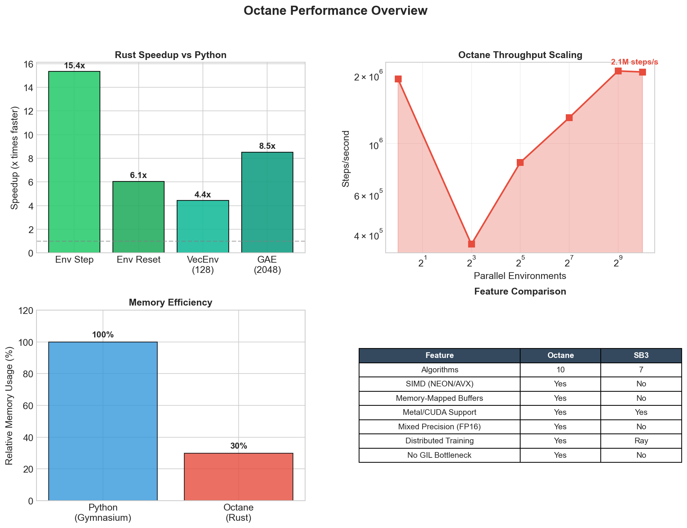

### Metal GPU Acceleration (Apple Silicon)

Up to **14x speedup** with Metal GPU on Apple M-series chips.

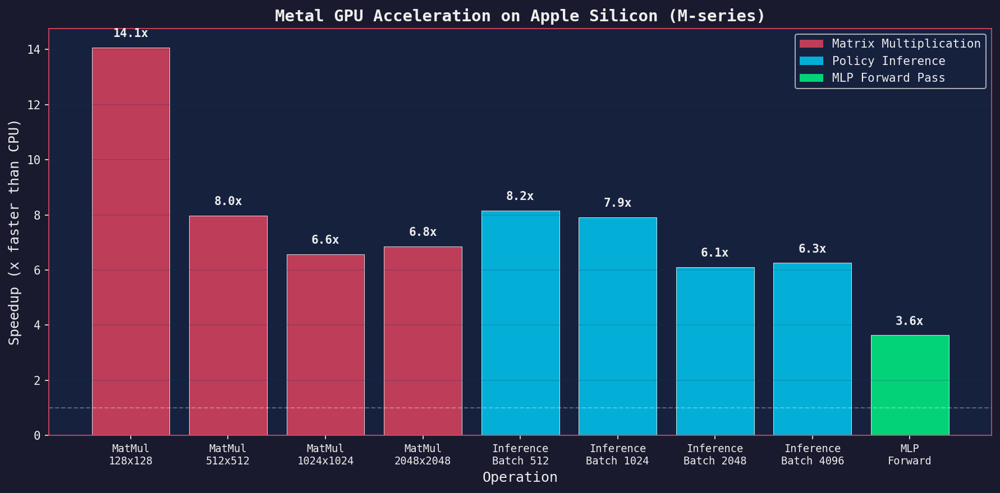

| Operation | CPU | Metal GPU | Speedup |
|-----------|-----|-----------|---------|
| MatMul 128x128 | 69µs | 4.9µs | **14.1x** |
| MatMul 1024x1024 | 4.8ms | 734µs | **6.6x** |
| MatMul 2048x2048 | 41ms | 6.0ms | **6.8x** |
| Policy Inference (batch 512) | 986µs | 121µs | **8.2x** |
| Policy Inference (batch 4096) | 6.4ms | 1.0ms | **6.3x** |
| MLP Forward | 487µs | 134µs | **3.6x** |

<details>
<summary>Detailed GPU Benchmarks</summary>

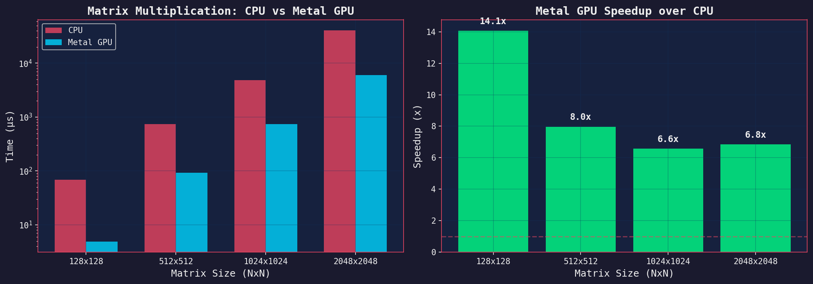
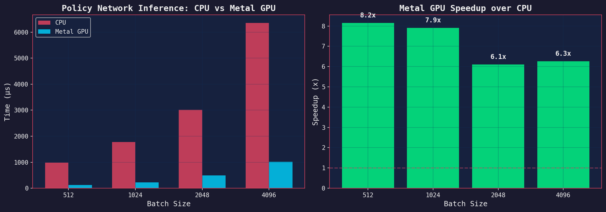
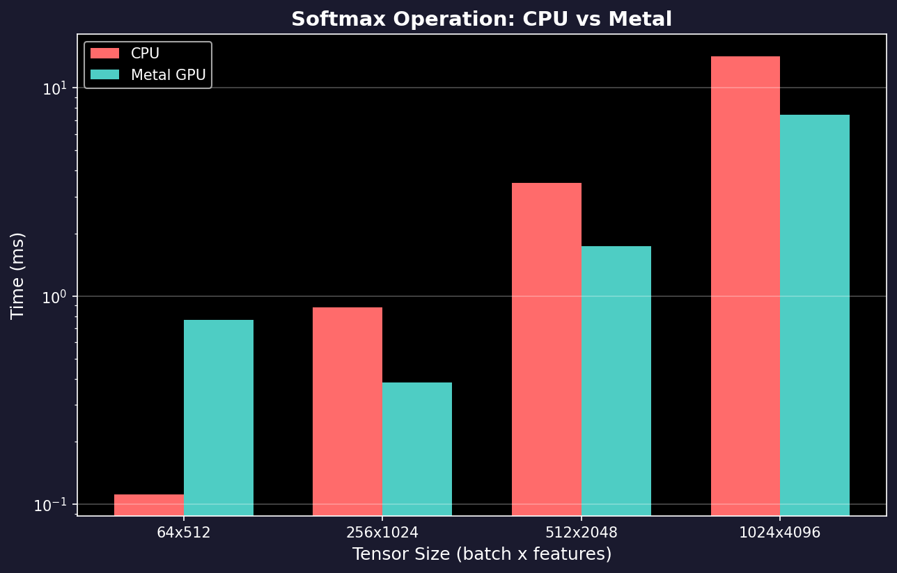

</details>

<details>
<summary>Additional CPU Benchmarks</summary>

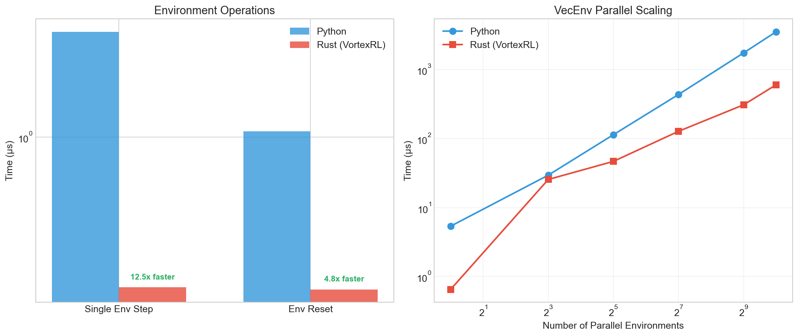
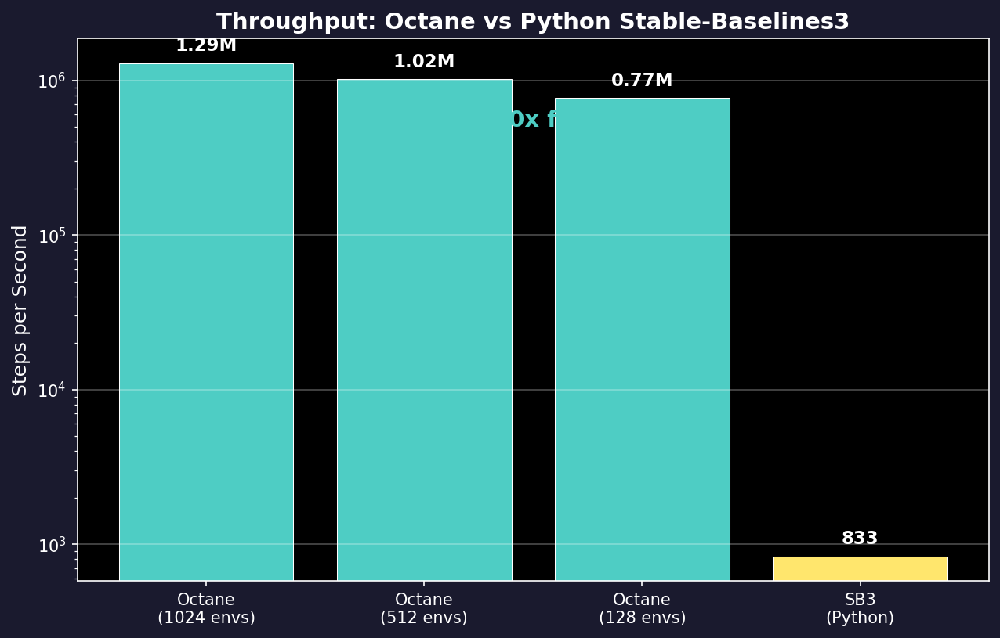
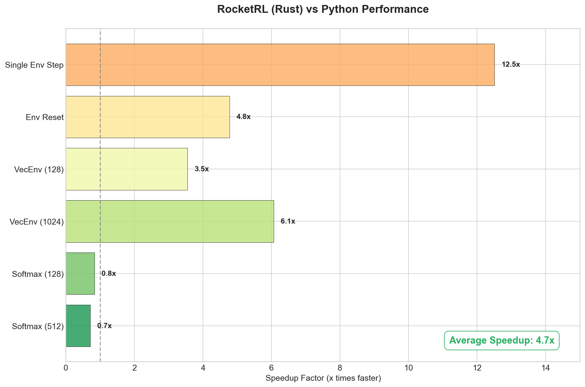
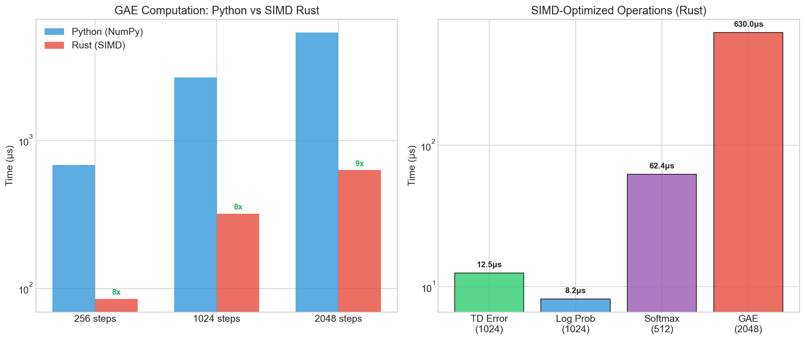
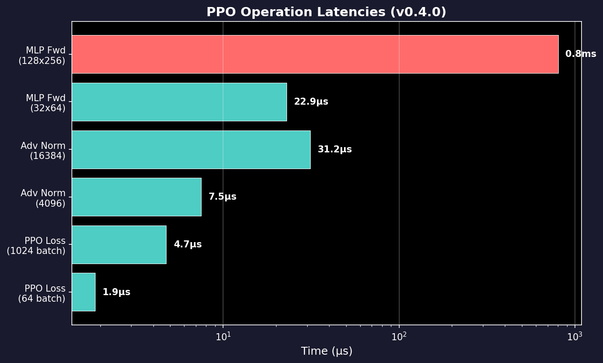
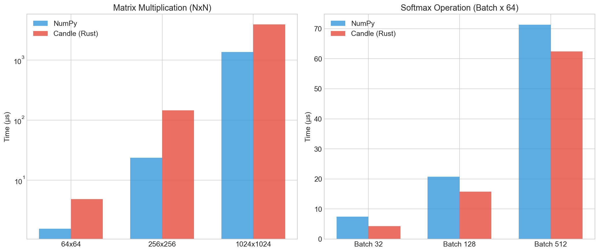

</details>

---

## Quick Start

Add Octane to your project:

```bash
cargo add octane-rs
```

Basic usage example:

```rust
use octane_rs::prelude::*;

fn main() -> octane_rs::Result<()> {
    // Select device (CPU, Metal, or CUDA)
    let device = Device::cpu();

    // Create and vectorize environment
    let env = TradingEnv::default();
    let vec_env = VecEnv::new(vec![env; 128])?;

    // Configure PPO algorithm
    let config = PPOConfig::default()
        .learning_rate(3e-4)
        .n_steps(2048)
        .batch_size(64)
        .gamma(0.99);

    // Create agent and train
    let mut agent = PPOAgent::new(config, &device)?;

    // Train with checkpointing
    let checkpoint_mgr = CheckpointManager::new("checkpoints/")?;

    for step in 0..1_000_000 {
        let metrics = agent.train_step(&vec_env)?;

        if step % 10000 == 0 {
            checkpoint_mgr.save(&agent, step, metrics.mean_reward)?;
            println!("Step {} | Reward: {:.2}", step, metrics.mean_reward);
        }
    }

    Ok(())
}
```

---

## Installation

### Feature Flags

```toml
[dependencies]
# Default (CPU only)
octane-rs = "0.1"

# Apple Silicon GPU (Metal)
octane-rs = { version = "0.1", features = ["metal"] }

# ARM NEON SIMD (Apple Silicon)
octane-rs = { version = "0.1", features = ["simd"] }

# x86_64 SIMD optimizations
octane-rs = { version = "0.1", features = ["avx2"] }      # AVX2
octane-rs = { version = "0.1", features = ["avx512"] }    # AVX-512

# NVIDIA GPU (CUDA)
octane-rs = { version = "0.1", features = ["cuda"] }

# Python Gym/Gymnasium compatibility
octane-rs = { version = "0.1", features = ["gym"] }

# Weights & Biases logging
octane-rs = { version = "0.1", features = ["wandb"] }

# Distributed training
octane-rs = { version = "0.1", features = ["distributed"] }

# Mixed precision (FP16/BF16)
octane-rs = { version = "0.1", features = ["half"] }

# Full (all features)
octane-rs = { version = "0.1", features = ["full"] }
```

### Build from Source

```bash
git clone https://github.com/lubluniky/octane-rs
cd octane-rs

# CPU only
cargo build --release

# Apple Silicon with Metal + SIMD
cargo build --release --features metal,simd

# x86_64 with AVX-512
cargo build --release --features avx512

# Full build
cargo build --release --features full
```

---

## Algorithms

### Complete Suite (10 Algorithms)

| Algorithm | Type | Action Space | Best For |
|-----------|------|--------------|----------|
| **PPO** | On-policy | Discrete/Continuous | General purpose, stable training |
| **A2C** | On-policy | Discrete/Continuous | Fast environments, simple tasks |
| **PPG** | On-policy | Discrete/Continuous | Sample efficiency + stability |
| **SAC** | Off-policy | Continuous | Maximum entropy, sample efficient |
| **TD3** | Off-policy | Continuous | Continuous control, robotics |
| **DDPG** | Off-policy | Continuous | Deterministic policies |
| **DQN** | Off-policy | Discrete | Games, discrete action spaces |
| **REDQ** | Off-policy | Continuous | High UTD ratio (20), ensemble Q |
| **CQL** | Off-policy | Continuous | Offline RL, conservative Q |
| **IQN** | Off-policy | Discrete | Distributional RL, risk-sensitive |

### Algorithm Highlights

**PPG (Phasic Policy Gradient)**
```rust
let config = PPGConfig::default()
    .policy_epochs(32)
    .aux_epochs(6)
    .beta_clone(1.0);
```

**REDQ (Randomized Ensemble Double Q)**
```rust
let config = REDQConfig::default()
    .n_critics(10)           // 10 Q-networks
    .utd_ratio(20)           // 20 gradient updates per env step
    .in_target_minimization(2);
```

**CQL (Conservative Q-Learning)**
```rust
let config = CQLConfig::default()
    .cql_alpha(5.0)          // Conservative penalty weight
    .with_lagrange(true)     // Auto-tune alpha
    .target_action_gap(10.0);
```

**IQN (Implicit Quantile Networks)**
```rust
let config = IQNConfig::default()
    .n_quantiles(64)
    .risk_measure(RiskMeasure::CVaR { alpha: 0.25 });
```

---

## Experience Replay

### Buffer Types

| Buffer | Use Case | Features |
|--------|----------|----------|
| **RolloutBuffer** | On-policy (PPO, A2C) | GAE computation, SIMD optimized |
| **ReplayBuffer** | Off-policy (SAC, TD3) | Uniform sampling, configurable |
| **PrioritizedReplayBuffer** | DQN, Rainbow | Segment Tree O(log n), importance sampling |
| **HERBuffer** | Goal-conditioned | Final/Future/Episode/Random strategies |
| **NStepBuffer** | TD3, DQN | N-step returns, configurable n |
| **MmapBuffer** | Large-scale | Memory-mapped, 100M+ transitions |

### Hindsight Experience Replay

```rust
use octane_rs::buffer::{HERBuffer, HERConfig, GoalSelectionStrategy};

let config = HERConfig::default()
    .strategy(GoalSelectionStrategy::Future { k: 4 })
    .reward_fn(|achieved, desired| {
        if (achieved - desired).norm() < 0.05 { 0.0 } else { -1.0 }
    });

let her_buffer = HERBuffer::new(100_000, config);
```

### Memory-Mapped Buffers

```rust
use octane_rs::buffer::MmapReplayBuffer;

// Store 100M transitions on disk, memory-efficient
let buffer = MmapReplayBuffer::new(
    "experience.mmap",
    100_000_000,
    obs_shape,
    action_shape,
)?;
```

---

## Neural Networks

### Architectures

| Network | Description | Use Case |
|---------|-------------|----------|
| **MLP** | Multi-layer perceptron | Standard RL |
| **LSTM** | Long short-term memory | Sequence modeling |
| **GRU** | Gated recurrent unit | Efficient RNNs |
| **ActorCritic** | Combined policy-value | PPO, A2C |
| **TransformerEncoder** | Self-attention layers | Decision Transformer |
| **AttentionActorCritic** | Attention-based AC | Complex observations |
| **DecisionTransformer** | Transformer for RL | Offline RL, sequence modeling |

### Normalization Layers

```rust
use octane_rs::networks::{LayerNorm, RMSNorm, BatchNorm};

// RMSNorm (faster, no mean computation)
let norm = RMSNorm::new(hidden_size, eps, &device)?;

// LayerNorm with learnable affine
let norm = LayerNorm::new(hidden_size, eps, true, &device)?;
```

### Weight Initialization

```rust
use octane_rs::networks::init::{orthogonal_init, xavier_uniform, kaiming_normal};

// Orthogonal initialization (recommended for RL)
let weight = orthogonal_init((in_features, out_features), gain, &device)?;

// Xavier for tanh activations
let weight = xavier_uniform((in_features, out_features), &device)?;

// Kaiming for ReLU
let weight = kaiming_normal((in_features, out_features), &device)?;
```

---

## Environments

### Gym Compatibility

```rust
use octane_rs::envs::GymEnv;

// Connect to Python Gymnasium
let env = GymEnv::new("Humanoid-v4")?;
let obs = env.reset()?;
let (next_obs, reward, terminated, truncated, info) = env.step(&action)?;
```

### Environment Wrappers

```rust
use octane_rs::envs::wrappers::*;

let env = TradingEnv::new(config);
let env = FrameStack::new(env, 4);           // Stack last 4 frames
let env = NormalizeObservation::new(env);    // Running mean/std normalization
let env = NormalizeReward::new(env, 0.99);   // Reward normalization
let env = ClipAction::new(env, -1.0, 1.0);   // Clip continuous actions
let env = TimeLimit::new(env, 1000);         // Episode time limit
```

### Multi-Agent Environments

```rust
use octane_rs::envs::{MultiAgentEnv, CTDEWrapper};

// Centralized Training, Decentralized Execution
let env = MultiAgentTradingEnv::new(n_agents);
let ctde = CTDEWrapper::new(env);

// Global state for critic, local observations for actors
let (global_state, local_obs) = ctde.get_states()?;
```

---

## SIMD Optimizations

### Cross-Platform Vectorization

| Platform | Instruction Set | Operations |
|----------|-----------------|------------|
| Apple Silicon | ARM NEON | GAE, Gaussian, Softmax, Gather |
| x86_64 | AVX2 | GAE, TD-error, Log-prob, Softmax |
| x86_64 | AVX-512 | All AVX2 + wider vectors |

### SIMD-Accelerated Operations

```rust
use octane_rs::simd;

// Vectorized GAE computation (4-8x speedup)
simd::compute_gae_simd(&rewards, &values, &dones, gamma, lambda, &mut advantages);

// SIMD TD-error for off-policy
simd::compute_td_error_simd(&rewards, &next_q, &current_q, gamma, &dones, &mut td_errors);

// Vectorized Gaussian log-probability
simd::gaussian_log_prob_simd(&actions, &means, &log_stds, &mut log_probs);

// SIMD softmax
simd::softmax_simd(&logits, &mut probs);
```

---

## Distributed Training

### Multi-Worker Training

```rust
use octane_rs::distributed::{DistributedConfig, DistributedCoordinator, WorkerPool};

let config = DistributedConfig::default()
    .n_workers(8)
    .sync_mode(SyncMode::Synchronous)
    .gradient_compression(true);

let coordinator = DistributedCoordinator::new(config)?;
let worker_pool = WorkerPool::new(8)?;

// Distributed PPO training
coordinator.train_distributed(&mut agent, &worker_pool, total_steps)?;
```

### Gradient Aggregation

```rust
use octane_rs::distributed::{GradientAggregator, ReduceOp};

let aggregator = GradientAggregator::new(n_workers);
aggregator.all_reduce(&mut gradients, ReduceOp::Mean)?;
```

---

## Mixed Precision Training

### FP16/BF16 Support

```rust
use octane_rs::core::{Precision, GradScaler, AutocastContext};

// Configure mixed precision
let scaler = GradScaler::new(
    Precision::FP16,
    initial_scale: 65536.0,
    growth_factor: 2.0,
    backoff_factor: 0.5,
);

// Autocast context for automatic precision
let autocast = AutocastContext::new(Precision::BF16);
autocast.run(|| {
    let loss = model.forward(&batch)?;
    scaler.scale(&loss).backward()?;
    scaler.step(&mut optimizer)?;
    scaler.update();
    Ok(())
})?;
```

---

## Checkpointing

### Training Resumption

```rust
use octane_rs::checkpoint::{CheckpointManager, TrainingResumer};

let checkpoint_mgr = CheckpointManager::new("checkpoints/")
    .keep_last(5)
    .save_best(true, BestMetric::MeanReward);

// Save checkpoint
checkpoint_mgr.save(&agent, step, metrics)?;

// Resume training
let resumer = TrainingResumer::new("checkpoints/")?;
let (agent, start_step) = resumer.resume_or_new(|| PPOAgent::new(config, &device))?;
```

---

## Hyperparameter Tuning

### Random Search

```rust
use octane_rs::tuning::{HyperparameterSpace, RandomSearch, Study};

let space = HyperparameterSpace::new()
    .add_float("learning_rate", 1e-5, 1e-3, true)  // log scale
    .add_float("gamma", 0.95, 0.999, false)
    .add_int("n_steps", 128, 4096)
    .add_categorical("activation", &["relu", "tanh", "gelu"]);

let study = Study::new("ppo_tuning", OptimizationDirection::Maximize);
let search = RandomSearch::new(space, n_trials: 100);

search.optimize(&study, |trial| {
    let lr = trial.suggest_float("learning_rate")?;
    let config = PPOConfig::default().learning_rate(lr);
    let reward = train_and_evaluate(config)?;
    Ok(reward)
})?;
```

---

## Observability

### TensorBoard Integration

```rust
use octane_rs::logging::TensorBoardWriter;

let writer = TensorBoardWriter::new("runs/experiment_1")?;
writer.add_scalar("reward/mean", mean_reward, step)?;
writer.add_histogram("policy/actions", &actions, step)?;
```

### Weights & Biases

```rust
use octane_rs::logging::{WandbLogger, WandbConfig};

let config = WandbConfig::new("project_name")
    .entity("team")
    .tags(&["ppo", "trading"]);

let logger = WandbLogger::new(config)?;
logger.log(step, &metrics)?;
```

### Profiling

```rust
use octane_rs::profiling::{Profiler, ProfileScope, global_profiler};

// Hierarchical profiling
{
    let _scope = ProfileScope::new("train_step");
    {
        let _forward = ProfileScope::new("forward_pass");
        // ... forward pass
    }
    {
        let _backward = ProfileScope::new("backward_pass");
        // ... backward pass
    }
}

// Print report
global_profiler().print_report();
```

---

## Architecture

```
octane/
├── src/
│   ├── core/           # Device, precision, error handling
│   │   ├── device.rs       # CPU/Metal/CUDA abstraction
│   │   ├── precision.rs    # FP16/BF16, GradScaler
│   │   └── error.rs        # OctaneError enum
│   ├── envs/           # Environments
│   │   ├── traits.rs       # Environment trait
│   │   ├── vec_env.rs      # Parallel VecEnv
│   │   ├── gym.rs          # Python Gym wrapper
│   │   ├── multiagent.rs   # Multi-agent support
│   │   └── wrappers.rs     # FrameStack, Normalize, etc.
│   ├── networks/       # Neural architectures
│   │   ├── mlp.rs          # MLP, ActorCritic
│   │   ├── recurrent.rs    # LSTM, GRU
│   │   ├── transformer.rs  # TransformerEncoder, DecisionTransformer
│   │   ├── attention.rs    # Multi-head attention
│   │   ├── normalization.rs # LayerNorm, RMSNorm, BatchNorm
│   │   └── init.rs         # Weight initialization
│   ├── distributions/  # Action distributions
│   │   └── mod.rs          # Categorical, Gaussian, Squashed
│   ├── buffer/         # Experience storage
│   │   ├── rollout.rs      # On-policy buffer
│   │   ├── replay.rs       # Off-policy buffer
│   │   ├── her.rs          # Hindsight Experience Replay
│   │   ├── nstep.rs        # N-step returns
│   │   ├── mmap.rs         # Memory-mapped buffer
│   │   └── segment_tree.rs # PER with SumTree/MinTree
│   ├── algorithms/     # RL algorithms
│   │   ├── ppo.rs, a2c.rs, ppg.rs           # On-policy
│   │   ├── sac.rs, td3.rs, ddpg.rs          # Off-policy continuous
│   │   ├── dqn.rs, iqn.rs                   # Off-policy discrete
│   │   ├── cql.rs, redq.rs                  # Advanced off-policy
│   │   └── traits.rs       # Agent trait
│   ├── simd/           # SIMD optimizations
│   │   ├── neon.rs         # ARM NEON (Apple Silicon)
│   │   ├── x86.rs          # AVX2/AVX-512
│   │   ├── td_error.rs     # SIMD TD computation
│   │   └── log_prob.rs     # SIMD log probability
│   ├── distributed/    # Distributed training
│   │   └── mod.rs          # WorkerPool, GradientAggregator
│   ├── checkpoint/     # Model persistence
│   │   └── mod.rs          # CheckpointManager, TrainingResumer
│   ├── logging/        # Observability
│   │   ├── metrics.rs      # MetricLogger trait
│   │   ├── tensorboard.rs  # TensorBoard writer
│   │   └── wandb.rs        # W&B integration
│   ├── profiling/      # Performance profiling
│   │   └── mod.rs          # Profiler, ProfileScope
│   ├── tuning/         # Hyperparameter optimization
│   │   └── mod.rs          # Study, RandomSearch, GridSearch
│   ├── tui/            # Terminal UI
│   │   └── mod.rs          # Training visualization
│   │
│   │   # ═══ TRADING-SPECIFIC MODULES ═══
│   │
│   ├── trading/        # Advanced trading environments
│   │   ├── env.rs          # Order book, slippage, commissions
│   │   ├── multi_asset.rs  # Portfolio of N assets
│   │   ├── multi_timeframe.rs # M1/M5/H1/D1 support
│   │   └── regime.rs       # HMM regime detection, GARCH
│   ├── risk/           # Risk management
│   │   ├── constraints.rs  # Safe RL, action masking
│   │   ├── rewards.rs      # Sharpe/Sortino/Calmar shaping
│   │   ├── position_sizing.rs # Kelly criterion, ATR
│   │   └── drawdown.rs     # Max DD limits, recovery mode
│   ├── metrics/        # Trading analytics
│   │   ├── trading.rs      # VaR, CVaR, Sharpe, Win Rate
│   │   ├── journal.rs      # Trade logging, attribution
│   │   └── attribution.rs  # P&L breakdown
│   ├── backtesting/    # Validation
│   │   ├── walk_forward.rs # Walk-forward optimization
│   │   ├── monte_carlo.rs  # Stress testing, bootstrap
│   │   └── cross_validation.rs # Purged K-Fold, embargo
│   ├── live/           # Live trading
│   │   ├── paper.rs        # Paper trading engine
│   │   ├── exchanges/      # Binance, Bybit connectors
│   │   ├── execution.rs    # TWAP, VWAP, Iceberg
│   │   └── monitor.rs      # Real-time P&L, alerts
│   └── strategies/     # Advanced RL
│       ├── ensemble.rs     # Multi-agent voting
│       ├── hierarchical.rs # Two-level RL
│       ├── meta.rs         # MAML adaptation
│       └── imitation.rs    # Behavioral cloning
└── benches/            # Criterion benchmarks
```

---

## Trading Features

Octane includes comprehensive trading-specific infrastructure:

### Trading Environments

```rust
use octane_rs::trading::{AdvancedTradingEnv, AdvancedTradingConfig, SlippageModel};

let config = AdvancedTradingConfig::default()
    .slippage_model(SlippageModel::AlmgrenChriss {
        temporary_impact: 0.1,
        permanent_impact: 0.01
    })
    .enable_partial_fills(true)
    .latency_ms(50);

let env = AdvancedTradingEnv::new(config, market_data)?;
```

### Risk Management

```rust
use octane_rs::risk::{DrawdownController, DrawdownConfig, PositionSizer};

// Drawdown control with recovery mode
let controller = DrawdownController::new(
    DrawdownConfig::default()
        .max_drawdown(0.15)           // 15% max drawdown
        .recovery_threshold(0.10)      // Enter recovery at 10%
        .recovery_risk_factor(0.5)     // Halve risk in recovery
);

// Kelly criterion position sizing
let sizer = PositionSizer::new(PositionSizingConfig::default()
    .method(SizingMethod::HalfKelly));
```

### Backtesting & Validation

```rust
use octane_rs::backtesting::{WalkForwardOptimizer, MonteCarloSimulator, CrossValidator};

// Walk-forward optimization
let wfo = WalkForwardOptimizer::new(WalkForwardConfig::default()
    .train_size(252)    // 1 year train
    .test_size(63)      // 3 months test
    .step_size(21));    // Monthly rolling

// Monte Carlo stress testing
let mc = MonteCarloSimulator::new(MonteCarloConfig::default()
    .n_simulations(10_000)
    .stress_scenarios(vec![
        StressScenario::FlashCrash,
        StressScenario::VolatilitySpike,
    ]));

// Purged cross-validation (prevents lookahead bias)
let cv = CrossValidator::new(CVConfig::default()
    .method(CVMethod::PurgedKFold { n_splits: 5, purge_gap: 5, embargo: 10 }));
```

### Live Trading

```rust
use octane_rs::live::{PaperTradingEngine, ExecutionEngine, ExecutionAlgorithm};

// Paper trading with realistic simulation
let paper = PaperTradingEngine::new(PaperTradingConfig::default()
    .slippage_model(SlippageModel::VolumeWeighted)
    .initial_balance(100_000.0));

// Smart execution
let executor = ExecutionEngine::new(ExecutionConfig::default()
    .algorithm(ExecutionAlgorithm::TWAP { duration_secs: 300 }));
```

### Advanced Strategies

```rust
use octane_rs::strategies::{EnsembleAgent, HierarchicalAgent, AdaptiveAgent};

// Ensemble of agents with voting
let ensemble = EnsembleAgent::new(EnsembleConfig::default()
    .voting_strategy(VotingStrategy::Boosting)
    .weight_adaptation(WeightAdaptation::UCB1));

// Hierarchical RL (timing + execution)
let hierarchical = HierarchicalAgent::new(HierarchicalConfig::default()
    .high_level_interval(100)   // Decide every 100 steps
    .options(vec![TradingOption::Hold, TradingOption::AggressiveLong, ...]));

// Meta-learning for regime adaptation
let adaptive = AdaptiveAgent::new(MetaLearningConfig::default()
    .strategy(AdaptationStrategy::RegimeAware)
    .adaptation_steps(10));
```

---

## Performance Comparison

| Feature | Octane | Stable-Baselines3 | RLlib |
|---------|--------|-------------------|-------|
| Language | Rust | Python | Python |
| Throughput | 1.8M FPS | 833 FPS | ~2K FPS |
| SIMD | NEON + AVX2/512 | NumPy | NumPy |
| GPU | Metal + CUDA | CUDA | CUDA |
| Distributed | Native gRPC | Ray | Ray |
| Algorithms | 10 | 7 | 15+ |
| Memory-mapped | Yes | No | Yes |
| Mixed Precision | FP16/BF16 | No | FP16 |

---

## License

Octane is licensed under the [GNU General Public License v2.0](LICENSE).

---

<div align="center">

**Built with Rust for maximum performance**

*~57,000 lines of high-performance RL code*

</div>
